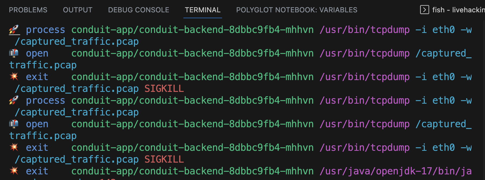

# Secure Env

After noticing strange behavior on test environment, we want to secure our prod env.
Therefore, some actions have been taken by Head Of Security.

* We force all our employees to change their passwords.
* We deploy an ingress-nginx in front of jenkins to log all the logins.
* We deploy tetragon to observe the root console of K8s.
* We define a tetragon tracing policy that prevents changing haproxy files.

# Attack Again & Defend

## Jenkins Bruteforce

The attacker tries to bruteforce and login to jenkins on the test env again and this time we get the login attempts in the logs:

```bash
kubectl get pod -n ingress-nginx
kubectl logs <Ingress-Controller-Pod-Name> -f -n ingress-nginx
```

## Passively Receiving K8s Pod TCP Traffic

The attacker switches to prod env on octant and plans to passively receive all TCP traffic sent to the conduit-backend container.

In order to do that, the attacker tries to inject a sidecar container in the app pod, which captures all TCP traffic passing through the pod's network interface and saves the received network traffic into a file.

Edit the app deployment:

```bash
kubectl edit deployment/conduit-backend
```

Inject the sidecar container, directly below `containers` on column 0
Also see [snippet](./snippets/sidecar.yaml) for live demo

```bash..
      - image: mirna/sidecar:0.9
        name: sidecar
```

The new container will not be deployed properly, since a SigKill will be sent to end that process from the tetragon policy we defined before.

### PROD

Switch to PROD via
```kubectl config use-context gke_thorsten-jakoby-tj-projekt_europe-west3_conduit-k8s-prod```

This can be checked using the following command:

```bash
kubectl get pod -n conduit-app
```

An error status will be noticed for the pods as in the following example:

```bash
conduit-backend-fdc76f894-596d6            1/2     Error              4 (51s ago)   98s
```

We get info about those trials to inject the sidecar and the SigKill action in the tetragon logs as follows:

```bash
kubectl logs -n kube-system ds/tetragon -c export-stdout -f | tetra getevents -o compact
```

You will see something like this in the logs:

